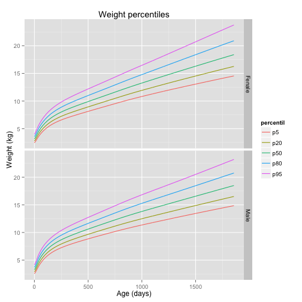

## Introduction

The WHO Multicentre Growth Reference Study (MGRS) was undertaken between 1997 and 2003 to generate new growth curves for assessing the growth and development of infants and young children around the world.

The MGRS collected primary growth data and related information from approximately 8500 children from widely different ethnic backgrounds and cultural settings (Brazil, Ghana, India, Norway, Oman and the USA).

The new growth curves are expected to provide a single international standard that represents the best description of physiological growth for all children from birth to five years of age and to establish the breastfed infant as the normative model for growth and development.

More info in <http://www.who.int/childgrowth/mgrs/en/>

--- .class #id 

## Data Source

The survey data are available in the next link.   
<http://www.who.int/entity/childgrowth/software/igrowup_R.zip>

I'll use the next files:   

- weianthro.txt: Weight data
- lenanthro.txt: Lenght data

The file's data format is LMS. Lambda-Mu-Sigma is a popular method for constructing centile curves.
When constructed for healthy children, these are used as reference for evaluating growth of children. Main feature of these plots is that percentiles look like a smooth curve over age.
The LMS data are associated with child's gender and age. 

Reference: [Demystifying LMS and BCPE Methods of Centile Estimation for Growth and Other Health Parameters] (http://www.who.int/entity/childgrowth/software/igrowup_R.zip)

--- .class #id 

## Data processing

Given a *y* value, get the associated percentile:

$$Z_{LMS} = \frac{1}{\sigma_L \lambda} \left[ \left( \frac{y}{\mu} \right) ^\lambda - 1 \right]$$ for $$y, \mu, \sigma_L, and \lambda \neq 0$$
   
   
Given a percentil, get the associated *y* value:

$$p^{th} percentile = \mu \left( 1 + \lambda \sigma_L Z_p  \right)$$

--- .class #id 

## Results sample

 

